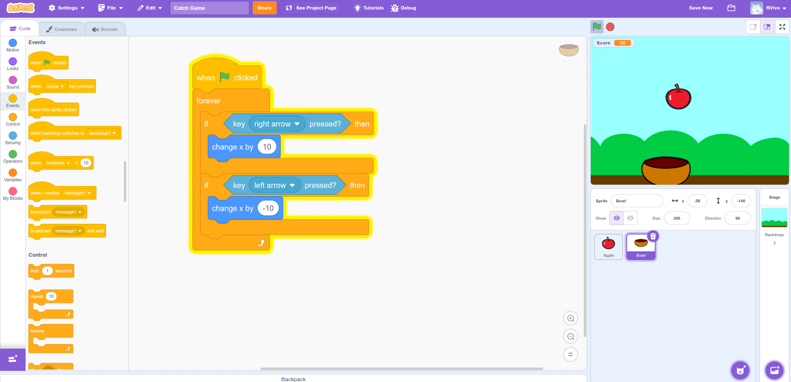
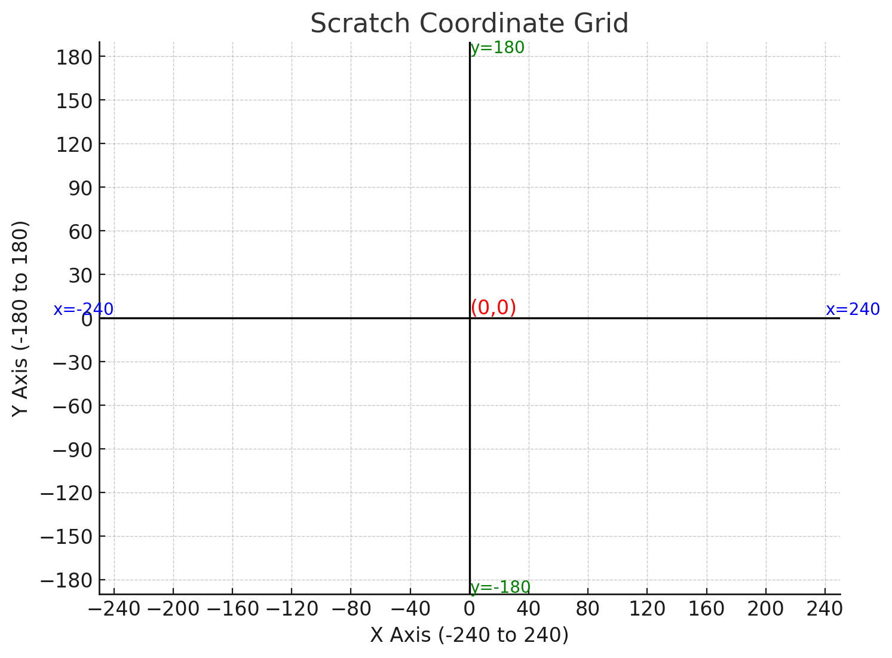
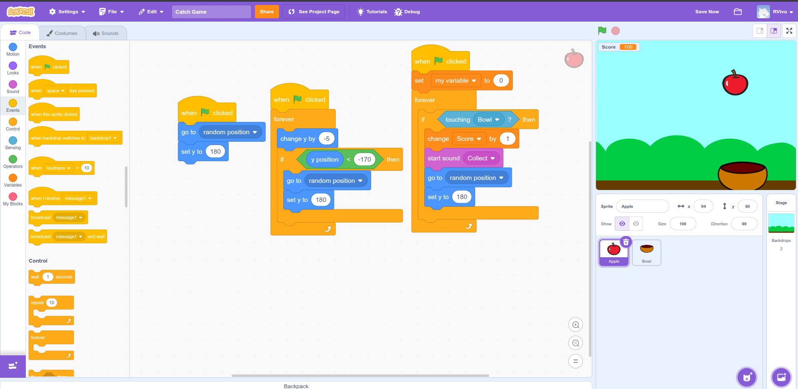

# Catch the Falling Apples - Scratch Project
A game where objects falling from the sky, you catch them to score points. It can be any objects that falling and it could be any character or object catching it.

---

## Objectives
1. Make the catcher move from right to left.
2. Make you object go to the top.
4. Make the object fall down.
5. Catch the object using the catcher.
6. Record the scores.

---

## What You Need
- Backdrop: **Blue Sky** or **Boardwalk** or any other relevant backdrop.
- Sprites:
  - **Apple** or **Ball** or **Ballon1** or any other relevant sprite (falling object).
  - **Bowl** or **Squirrel** or any other relevant sprite (the catcher).
- For this project I've used  **Blue Sky** as my backdrop, **Apple**  as the object and **Bowl** as the catcher.

---

##  Setup
1. Open Scratch and search/find and choose a backdrop called **Blue Sky**.  
2. Search or find a sprit called **Apple** .
3. Search or find a sprit called **Bowl**.

---

## Objective 1: Move the Catcher (Bowl)  

Make sure you select the **Bowl sprite** so that you put the blocks in the correct place.  
We will use the **arrow keys** to move the bowl across the screen.  
 **Tip:** Change the size of the Bowl to **200** so it’s big enough to catch the apple.  

---

### Bowl Script - Blocks You Need  

**a) `when green flag clicked` (Events)**  
- Starts the game when you press the green flag.  

**b) `if <> then` (Control) - get two blocks**  
- A conditional block: it only runs the command inside if the condition is **True**.  
- Drag two of these onto the workspace.  

**c) `key (space) pressed?` (Sensing) - get two blocks**  
- Detects when a key is pressed.  
- Put one inside the first `if <> then` block and change **space** to **Right Arrow**.  
- Put the second one inside the second `if <> then` block and change **space** to **Left Arrow**.  

**d) `change x by (10)` (Motion) - get two blocks**  
- Moves the sprite horizontally.  
- Place the first one inside the **Right Arrow if block** and leave it as `10` → moves right.  
- Place the second one inside the **Left Arrow if block** but change it to `-10` → moves left.  

**e) `forever` (Control)**  
- Wraps around the two `if <> then` blocks.  
- This makes the movement repeat forever as long as the game is running.  

---

Now test:  
- Press the **Right Arrow** → the bowl moves right.  
- Press the **Left Arrow** → the bowl moves left.

  Example Scratch Code:  

# Objective 2: Make the Apple Work

Make sure you select the **Apple sprite** so that you put the blocks in the correct place.  
We want the apple to start at the top, fall down, and reset whenever it reaches the bottom or is caught by the bowl.  

---

### Apple Script - Blocks You Need  

**a) `when green flag clicked` (Events)**  
- Starts the game when you press the green flag.  

**b) `go to random position` (Motion)**  
- Puts the apple at a random place along the top of the screen.  

**c) `set y to (180)` (Motion)**  
- In Scratch, **y** controls how high or low a sprite is.  
- The top of the stage is `y = 180`, so this block always makes the apple start at the very top.  

📖 Scratch Grid Quick Guide:
- The middle of the screen is `(0,0)`  
- **X-axis** goes left to right → from `-240` (left) to `240` (right)  
- **Y-axis** goes up and down → from `-180` (bottom) to `180` (top)  

---

## Objective 3: Make the Apple Fall  

**d) `change y by (-5)` (Motion)**  
- A negative number moves the sprite down.  
- This makes the apple fall smoothly.  

**e) `if <> then` (Control)**  
- Checks if a condition is true.  

**f) `y position` (Motion)** + `< < >` (Operators, green block)  
- Use this to check if the apple’s `y position < -170` (meaning it’s below the screen).  
- If that happens → use `go to random position` and `set y to (180)` to reset the apple back to the top.  

---

## Objective 4: Catch the Apple with the Bowl  

**g) `forever` (Control)**  
- Keeps checking the condition again and again.  

**h) `if <> then` (Control)**  
- Used to test if the apple is touching the bowl.  

**i) `touching [Bowl]?` (Sensing)**  
- Change from “mouse pointer” to **Bowl**.  
- This checks if the apple touches the bowl sprite.  

**j) `go to random position` (Motion) + `set y to (180)` (Motion)**  
- If the apple is caught, it jumps back to the top in a random position.  

**k) `start sound (collect)` (Sound)**  
- Plays a sound effect each time the apple is caught.  

---

## Objective 5: Keep Score  

**l) Make a variable → `score` (Variables)**  
- A variable is like a box that stores a number.  
- Here, it stores how many apples we catch.  

**m) `set score to (0)` (Variables)**  
- Put this block right under the green flag.  
- This makes sure the score starts at **0** whenever the game begins.  

**n) `change score by (1)` (Variables)**  
- Place this inside the `if touching Bowl then` block.  
- Every time the apple is caught, the score goes up by 1.  

---

Now test:  
- The apple starts at the top and falls down.  
- If it touches the bottom, it resets to the top.

  Example Scratch Code:  

- If it touches the Bowl, you hear a sound and your score increases by 1.

---

## Creative Extensions - Try Your Own Ideas!

Now that you know how to make a falling object game in Scratch, you can change the sprites and backdrop to create your **own unique version**.  
Here are some fun ideas:

1. **Jungle Adventure**  
   - Backdrop: Jungle  
   - Catcher: Fox  
   - Falling Object: Hearts (the fox collects hearts to gain energy)

2. **Keep the Ocean Clean**  
   - Backdrop: Under the Sea  
   - Catcher: Fish  
   - Falling Object: Trash (the fish collects trash to keep the ocean clean)

3. **Pet Treats**  
   - Backdrop: Backyard or Kitchen  
   - Catcher: Dog or Cat  
   - Falling Object: Treats or Bones  

4. **Space Explorer**  
   - Backdrop: Outer Space  
   - Catcher: Rocket  
   - Falling Object: Stars (collect stars to earn points)

5. **Basketball Game**  
   - Backdrop: Basketball Court  
   - Catcher: Basket or Player  
   - Falling Object: Basketballs  

6. **Fast Food Frenzy**  
   - Backdrop: Restaurant  
   - Catcher: Chef  
   - Falling Object: Burgers, Pizzas, or Fries  

7. **Holiday Gifts**  
   - Backdrop: Winter Wonderland  
   - Catcher: Santa  
   - Falling Object: Presents  

8. **Bee and Flowers**  
   - Backdrop: Garden  
   - Catcher: Bee  
   - Falling Object: Flowers (the bee collects nectar to make honey)

---

 Teachers can encourage students to:
- Swap out sprites and backdrops.  
- Change the speed of falling objects.  
- Add different sounds for each catch.  
- Try **two different objects falling at once** to make the game harder.  

This helps students show their **creativity** while practicing the same coding logic.

---

## How to Try This Project

If you want to check out my work:

1. Download the file **Catch Game.sb3** from this repository.  
2. Go to [Scratch](https://scratch.mit.edu/projects/editor/) (the online Scratch editor).  
3. In the editor, click **File** (top left).  
4. Select **Load from your computer**.  
5. Choose the downloaded `Catch Game.sb3` file.  

The game will load, and you can play or edit it directly in Scratch!

